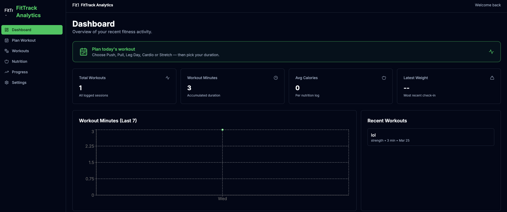
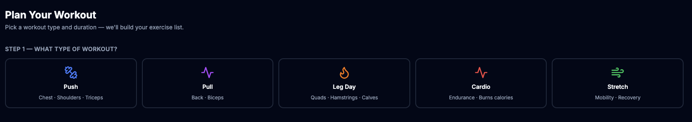
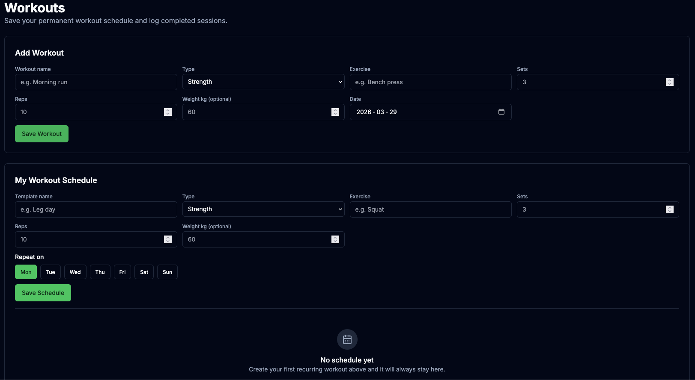
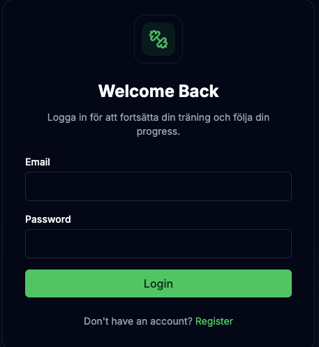
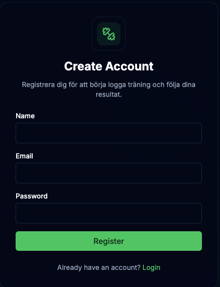
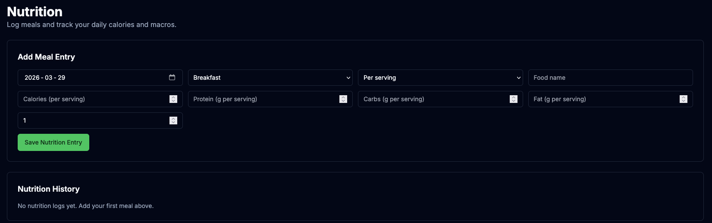
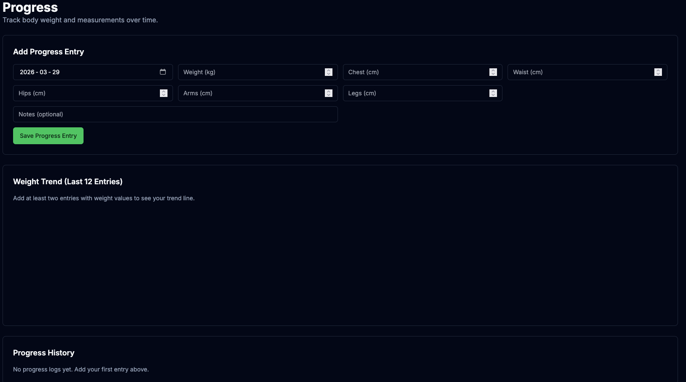

# FitTrack Analytics

FitTrack Analytics is a full-stack fitness tracker built with Next.js 14, TypeScript, MongoDB, and Tailwind CSS.

It includes authentication, workout and template management, nutrition and progress tracking, analytics charts, and a workout planner powered by wger data.

Visitors can also open a shared seeded dashboard directly without creating an account.

## Highlights

- Credential authentication with NextAuth
- Branded landing, login, and register pages with animated auth background
- Workout logging with exercise entries
- Recurring workout templates (create, list, delete, and log-as-workout)
- Workout planner flow (Push, Pull, Legs, Cardio, Stretch + duration selector)
- wger exercise search autocomplete and exercise image/video source integration
- Nutrition tracking with automatic macro totals
- Progress tracking for weight and measurements
- Dashboard summaries and charts
- User settings for profile and preferences
- Unit tests with Vitest and CI workflow for lint, test, and build

## Tech Stack

- Frontend: Next.js 14 (App Router), React 18, Tailwind CSS, Zustand
- Backend: Next.js Route Handlers, NextAuth, Mongoose
- Database: MongoDB
- Testing: Vitest
- Charts: Recharts
- Icons: Lucide React

## Project Structure

```text
src/
	app/
		(auth)/
		api/
			auth/
			exercises/
			nutrition/
			progress/
			user/
			workouts/
		dashboard/
	backend/
		config/
		middleware/
		models/
		services/
		validators/
	components/
	lib/
	store/
	types/
```

## Getting Started

### Prerequisites

- Node.js 18+
- MongoDB (Atlas or local)

### Install

```bash
git clone https://github.com/SaidInBytes/fittrack-analytics.git
cd fittrack-analytics
npm install
```

### Environment Variables

Create a `.env.local` file in the project root:

```env
MONGODB_URI=mongodb://localhost:27017/fittrack
NEXTAUTH_SECRET=your-super-secret-key-change-this-in-production
NEXTAUTH_URL=http://localhost:3000
WGER_API_KEY=your-wger-api-key
DEMO_USER_EMAIL=your-shared-access-email@example.com
DEMO_USER_PASSWORD=change-me-in-production
DEMO_USER_NAME=Shared Access
```

Notes:

- `WGER_API_KEY` is optional.
- The shared access profile is created automatically the first time an unauthenticated visitor opens the dashboard.
- Restart `npm run dev` after changing environment variables.

## Shared Access

Visitors can open `/dashboard` directly to browse a seeded shared profile.

- The shared profile is created automatically on first visit.
- The app seeds workouts, workout templates, nutrition logs, and progress history if the shared profile is empty.
- Override the shared profile values with `DEMO_USER_EMAIL`, `DEMO_USER_PASSWORD`, and `DEMO_USER_NAME` if you want different server-side values.

### Run Locally

```bash
npm run dev
```

Then open `http://localhost:3000`.

## Available Scripts

- `npm run dev` - start development server
- `npm run build` - production build
- `npm run start` - run production server
- `npm run lint` - lint project
- `npm test` - run unit tests
- `npm run test:watch` - run tests in watch mode

## Screenshots

### Dashboard



### Workout Planner



### Workouts



### Login



### Register



### Nutrition



### Progress



## API Endpoints

| Method | Endpoint | Description | Auth |
| --- | --- | --- | --- |
| POST | `/api/auth/register` | Register a new user | No |
| POST | `/api/auth/[...nextauth]` | Sign in with credentials | No |
| GET | `/api/workouts` | Get current user workouts | Yes |
| POST | `/api/workouts` | Create a workout | Yes |
| PUT | `/api/workouts` | Update a workout | Yes |
| DELETE | `/api/workouts` | Delete a workout | Yes |
| GET | `/api/workouts/templates` | List saved workout templates | Yes |
| POST | `/api/workouts/templates` | Create workout template | Yes |
| DELETE | `/api/workouts/templates/[id]` | Delete template by id | Yes |
| POST | `/api/workouts/templates/[id]` | Log template as workout | Yes |
| GET | `/api/exercises/search?query=...` | Search wger exercises | Yes |
| GET | `/api/exercises/plan?type=push&duration=60` | Generate planned exercises | Yes |
| GET | `/api/nutrition` | Get nutrition logs | Yes |
| POST | `/api/nutrition` | Create nutrition log | Yes |
| GET | `/api/progress` | Get progress entries | Yes |
| POST | `/api/progress` | Create progress entry | Yes |
| GET | `/api/user` | Get profile and preferences | Yes |
| PUT | `/api/user` | Update profile and preferences | Yes |

## Branding and Logo

The UI expects a logo file at:

- `public/logo.svg`

Used in:

- landing page
- login/register pages
- dashboard header/sidebar
- app metadata icons

If the file is missing on auth pages, a fallback icon is shown.

## Quality and CI

- Unit tests are implemented with Vitest
- GitHub Actions workflow runs:
	- lint
	- test
	- build

Workflow file:

- `.github/workflows/ci.yml`

## Deployment

Deploy on any platform that supports Next.js 14 (for example Vercel).

Required environment variables in production:

- `MONGODB_URI`
- `NEXTAUTH_SECRET`
- `NEXTAUTH_URL`
- `WGER_API_KEY` (optional)

## License

MIT
